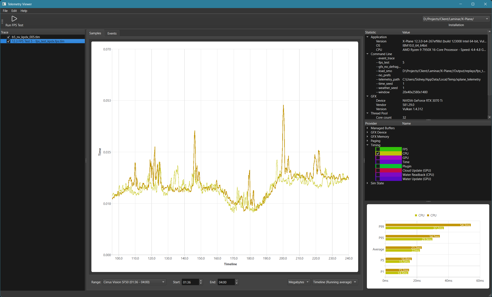

Telemetry Viewer is a Qt 6 based application that can be used to inspect [X-Plane 12](https://x-plane.com) telemetry files. This repository acts as both a reference for the X-Plane TLM file format and a convenient utility to visualize the files. This project started out as an internal one-off tool and as such is not necessarily a production grade codebase or program.

## Performance testing
One of the main use cases for Telemetry Viewer is performance testing. To make this as easy as possible, Telemetry Viewer has a built-in FPS test utility that can launch X-Plane with various configurations while also providing stable seeds to the various random number generators to make A/B testing possible. Note that FPS testing is not easily possible with the Steam version due to the way Steam handles launching of applications and passing of command line arguments.

## Telemetry files
X-Plane telemetry files include data from various providers within the sim. Each data point is associated with a timestamp making plotting of the data easy. Despite what their name suggests, telemetry files are only stored locally and rotated between X-Plane runs.

Telemetry files are designed to support partial writes and be still usable even after an X-Plane crash, although potentially truncated. As such telemetry files are uncompressed and don't have any forward references. The current file format version handles all data points on a single time domain, as such GPU timing data are rendered as if they are happening int the CPU time domain. This shouldn't be a problem for the majority of use cases, but it can make event correlation a little harder if it happens on the GPU timeline.

## Telemetry providers
X-Plane has various internal data providers which can generate telemetry data. Not all of these providers are always available and their behaviour can change depending on settings. For example CPU and GPU timing data is written as an average of once per second for regular sim runs to avoid excessive data generation. In FPS test mode however, performance data is available on a per frame granularity.

## License
Telemetry Viewer is released under the LGPL 3.0 license. Telemetry Viewer uses the Qt 6 library which is also licensed under the LGPL 3.0 license.

## Contribution
Pull requests are welcome, although there is no guarantee that they will be merged. Bug reports are more than welcome as well!